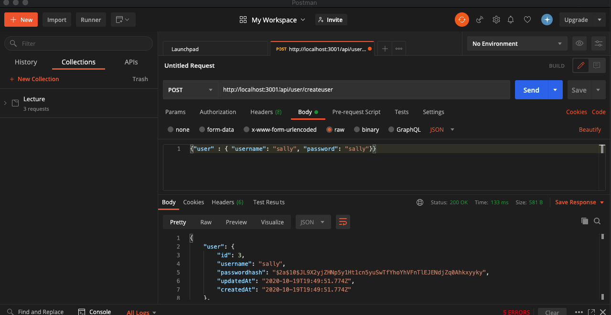
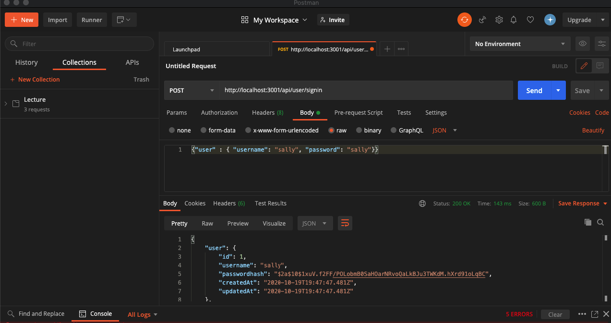
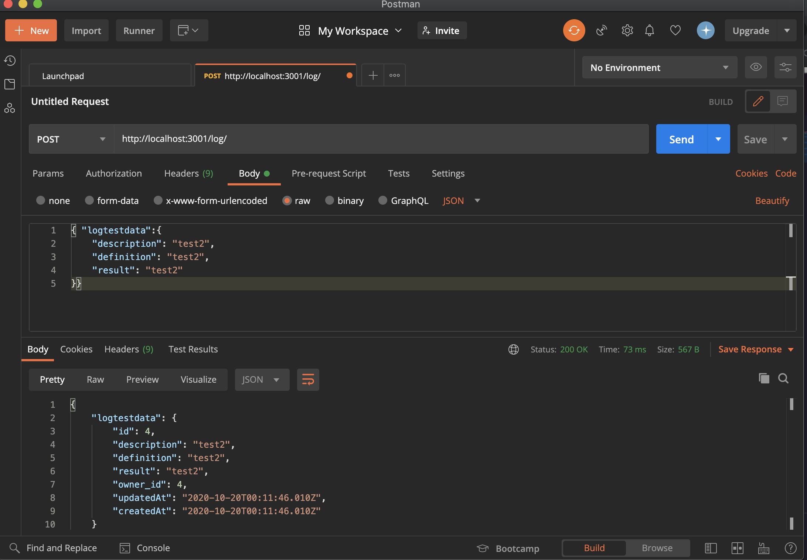
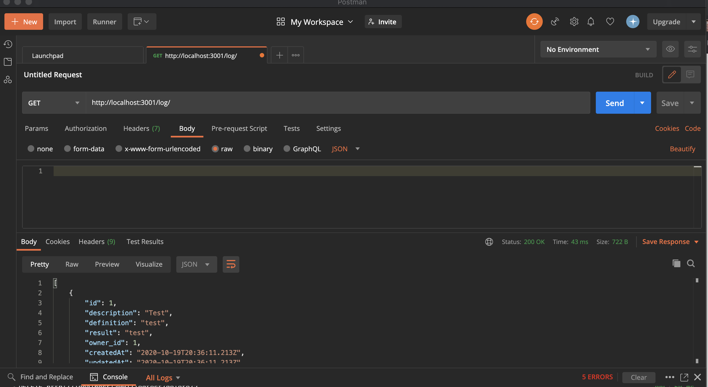
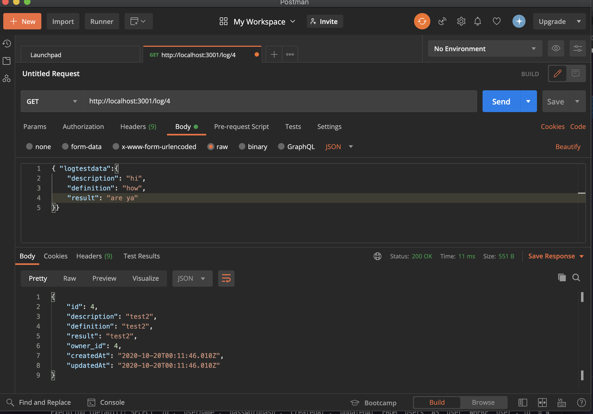
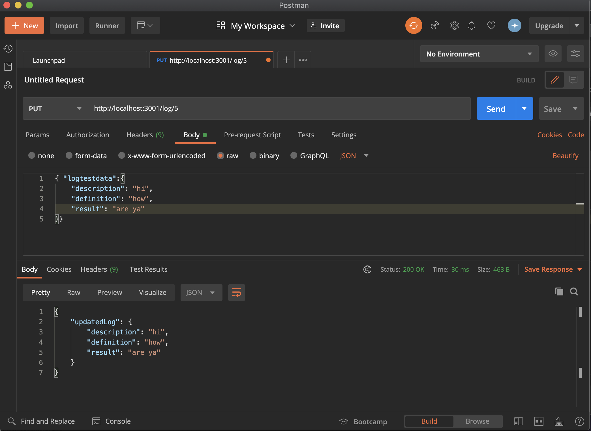
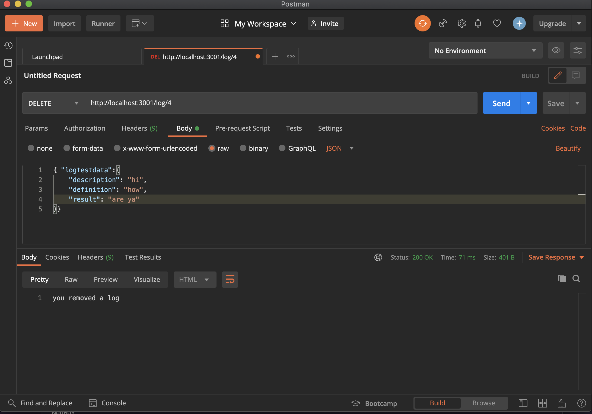

# Workout Log
This is my first server-side application that I've built during my course at Eleven Fifty Academy.

We were challenged to build only the server side of a Workout Log application without the guidance of instructors following a lecture and module covering the topic.

## Endpoint Screen Shots
Below are screen shots showing the functionality of my end points that I tested while building the app.

### 1. Create User

### 2. User Signin

### 3. Create a Workout Log

### 4. See All A User's Logged Workouts

### 5. See A Single Workout Log

### 6. Update or Make Changes to a Workout Log

### 7. Delete A Workout Log
